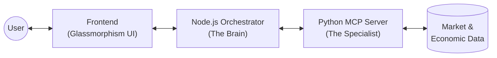
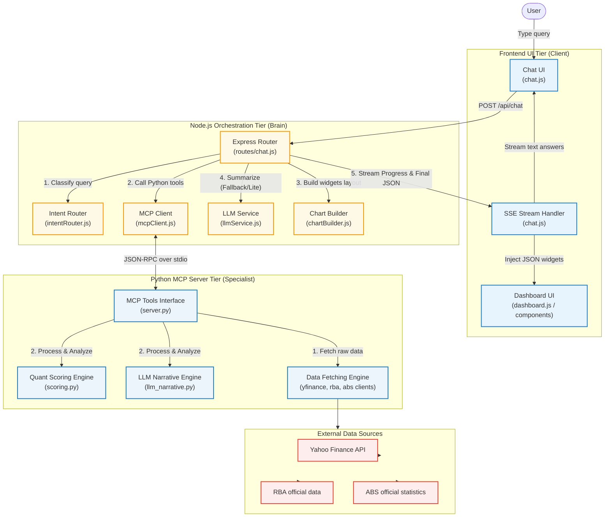
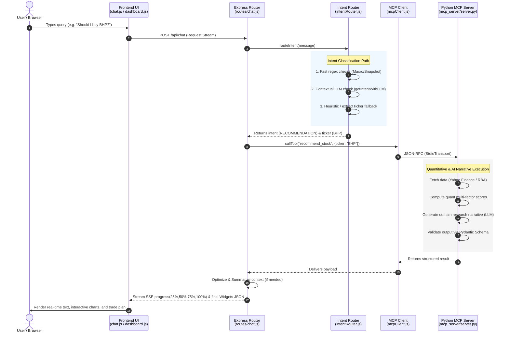
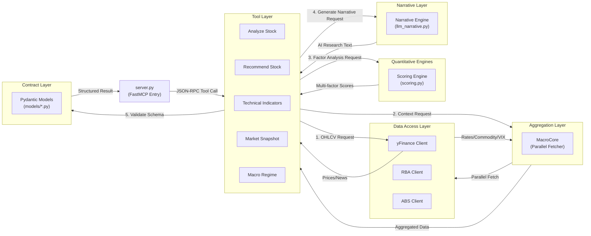

# QuantBot ASX System Architecture

This document describes the high-level architecture, service relationships, and directory structure of the QuantBot ASX research platform.

## 1. System Overview

QuantBot is a multi-layered application designed for professional ASX stock analysis. It follows a **Decoupled Orchestration** pattern where a Node.js server acts as the "Brain" (UI, Routing, Streaming, Model Selection, Dashboard Assembly) and a Python MCP server acts as the "Specialist" (Data, Scoring, Quantitative Analysis).



## 2. High-Level Components

## System High-Level Integration Diagram



### A. Frontend (Client Tier)

* **Technology:** Vanilla JavaScript (ES Modules), CSS3 (Modern Glassmorphism), Chart.js, Lightweight Charts.
* **`public/index.html`**: SPA shell with a split-pane layout (Chat left, Dashboard right).
* **`public/js/app.js`**: The main entry point. Orchestrates the global state, theme persistence (Light/Dark mode), and handles the split-pane resizing logic.
* **`public/js/chat.js`**: Core UI controller. Handles real-time communication via **Server-Sent Events (SSE)**, renders message bubbles, and manages the SSE progress bar and per-response duration.
* **`public/js/dashboard.js`**: Global dashboard coordinator. Handles skeleton views, session switching, and routes JSON widget payloads to modular UI sub-components.
* **`public/js/dashboard-components.js`**: Shared component core. Implements basic cards (KV lists, Tables, News feeds, Sparklines) and controls resizing listeners and theme synchronization.
* **`public/js/dashboard-techindicators.js`**: Dedicated renderer for technical analyses. Formulates custom `stock-hero` metrics, SMA/EMA spreadsheets (`ma-table`), and comprehensive candlestick charts using Lightweight Charts.
* **`public/js/dashboard-macroregime.js`**: Orchestrates `macro-hero` rendering, mapping economic and regulatory levels to responsive visual layouts.
* **`public/js/dashboard-analyzestock.js`**: Renders structural quantitative elements such as the `score-hero` scorecard (with dynamic formula visualization) and granular indicator descriptions.
* **`public/js/dashboard-recommmendstock.js`**: Governs action recommendation cards (`hero`) and target transaction parameters (`price-plan`).
* **`public/js/dashboard-marketsnapshot.js`**: Combines individual dashboard widgets into a comprehensive composite index view.

### B. Chatbot Server (Orchestration Tier)

* **Technology:** Node.js (Express), SSE Streaming.
* **`server/index.js`**: Entry point. Serves static files and mounts API routes.
* **`server/routes/chat.js`**: The Orchestrator. Manages the lifecycle of a chat request.
* **`server/services/`**: The "Business Logic" layer.

  * `intentRouter.js`: Hybrid intent classification (LLM + Heuristics).
  * `mcpClient.js`: The bridge to the Python environment via MCP Protocol.
  * `llmService.js`: Interface for chat summarization and JSON classification across Ollama and Gemini, with OpenAI used in the general-chat fallback path.
* **`server/utils/`**: The "UI Factory" layer.

  * `chartBuilder.js`: A critical mapping engine that takes raw Python tool outputs and assembles them into standardized JSON "widgets" (e.g., `stock-hero`, `price-plan`, `mini-charts`,`score-hero`) that the frontend can render.

### C. MCP Server (Intelligence Tier)

* **Technology:** Python (FastMCP), Pydantic, Pandas.

* **`mcp_server/server.py`**: The server interface. Uses the FastMCP framework to expose Python functions as tools over a JSON-RPC transport.

* **`mcp_server/tools/`**: The "Atomic Capabilities" layer. Each file maps to a specific intent:

  * `technical.py`: Implements `get_technical_indicators`.
  * `market_snapshot.py`: Implements `get_market_snapshot`.
  * `macro_regime.py`: Implements `get_macro_regime`.
  * `analysis.py`: Implements `analyze_stock`.
  * `recommendation.py`: Implements `recommend_stock`.

* **`mcp_server/models/`**: The "Data Contract" layer. Defines strict Pydantic schemas shared between tools:

  * `technical.py`: Indicators, Momentum, Volatility models.
  * `macro.py`: RBA Policy, ABS Growth/Inflation, Sector Performance models.
  * `recommendation.py`: Trade Guidance, Market Context, and consolidated Analysis models.

* **`mcp_server/analysis/`**: Quantitative engines.

  * `scoring.py`: The heart of the system. Contains the `score_stock` engine which calculates:

    * **Technical Scores**: RSI, MACD, SMA crossovers.
    * **Macro Scores**: Interest rate regimes, VIX risk scaling, and China-linkage factors.
  * `llm_narrative.py`: Handles complex prompt construction to generate stock-specific analyst summaries.

* **`mcp_server/data/`**: Specialized data clients and aggregators.

  * `yfinance_client.py`: Real-time market prices, history, and news.
  * `rba_client.py`: Official RBA cash rate data via CSV parsing.
  * `abs_client.py`: Key economic indicators (CPI, GDP, Unemployment) via stable RBA proxies.
  * `macro_core.py`: Parallel fetching coordination engine (**`MacroCore`**) that retrieves indexes, commodities, and economic indicators simultaneously to minimize latency.


## 3. Data Flow & Routing



### Internal MCP Lifecycle

When the MCP Server receives a tool call, it follows this layered deterministic pipeline across its modular components:




1. **Initiation**: `app.js` initializes the layout and theme. User types "Should I buy BHP?" in the chat input.
2. **Streaming Request**: `chat.js` sends a request to `POST /api/chat` and immediately begins reading the response body as a `ReadableStream` for real-time SSE updates.
3. **Intent Classification**: `server/routes/chat.js` passes the query to `intentRouter.js`, which identifies the `RECOMMENDATION` intent and extracts the ticker `BHP`.
4. **Language Bridge**: `mcpClient.js` invokes the Python sub-process (via JSON-RPC over `stdio`) to call the corresponding `recommend_stock` tool.
5. **Quantitative Execution**: The Python `mcp_server` fetches data via `yfinance_client` and `rba_client`, calculates scores using `analysis/scoring.py`, and returns a structured Pydantic-validated payload.
6. **UI Assembly**: `chartBuilder.js` transforms the raw Python result into an array of "UI Widgets" (JSON descriptors for heroes, tables, and trade plans).
7. **Conversational Layer (LLM Short-Circuit & Context Optimization)**: 
   * **Primary Path**: The Python `llm_narrative.py` engine generates a domain-specific research narrative alongside the quantitative data.
   * **Short-Circuit Optimization**: If `chat.js` detects the `narrative` field in the Python payload, it **bypasses** the Node.js LLM call entirely, rendering the text directly to the user.
   * **Context Optimization**: Before falling back to the Node.js LLM for summarization, large historical time-series data (e.g., price history) is stripped from the payload to reduce token usage and latency, while still preserving the full dataset for frontend rendering.
   * **Fallback Path**: If the Python narrative is missing (or if the query was a general conversational intent), Node's `llmService.js` is invoked as a fallback to generate a summary using the optimized payload.
8. **Real-time Delivery**: The chat router streams progress events (e.g., 25%, 50%) to the client. Finally, it sends a `complete` event containing the text and the widget array.
9. **Rendering**: `chat.js` consumes the SSE stream, updates the chat history and passes the widget data to `dashboard.js`, which performs the final DOM construction and initializes the charts.


## 4. Project Directory Structure

```text
/quantbot/
├── chatbot/                 # NODE.JS APPLICATION (Orchestrator)
│   ├── public/              # Frontend Tier
│   │   ├── css/app.css      # Glassmorphism, Themes & Layout
│   │   ├── js/              # Client-side Logic
│   │   │   ├── app.js       # App Entry & Theme Logic
│   │   │   ├── chat.js      # SSE Handler & Message UI
│   │   │   ├── dashboard.js # Widget Orchestration & Lifecycle Engine
│   │   │   ├── dashboard-components.js      # Shared UI Widgets & Helpers
│   │   │   ├── dashboard-techindicators.js  # Candle & Technical UI
│   │   │   ├── dashboard-macroregime.js     # Macro Summary UI
│   │   │   ├── dashboard-analyzestock.js    # Scoring & Formulas UI
│   │   │   ├── dashboard-recommmendstock.js # Recommendation & Entry Plan UI
│   │   │   └── dashboard-marketsnapshot.js  # Composite Index UI
│   │   └── index.html       # SPA Container Shell
│   ├── package.json         # Node.js Chatbot Config
│   └── server/              # Server-side Logic
│       ├── routes/chat.js   # SSE Pipeline & Task Orchestration
│       ├── services/        # Business Logic Layer
│       │   ├── intentRouter.js # Intent Classification (LLM+Heuristics)
│       │   ├── llmService.js   # Provide Abstraction, AI Summarization & Classification
│       │   └── mcpClient.js    # MCP stdio Protocol Bridge
│       └── utils/           # Helper Layer
│           └── chartBuilder.js # UI Widget Factory (JSON Transformer)
├── mcp_server/              # PYTHON INTELLIGENCE SERVER
│   ├── analysis/            # Quantitative Engines
│   │   ├── scoring.py       # Core Multi-factor Scoring Engine
│   │   └── llm_narrative.py # Research Narrative Generator
│   ├── data/                # Data Acquisition Clients
│   │   ├── yfinance_client.py # Market Price & News API
│   │   ├── rba_client.py     # RBA Official Data Parser
│   │   ├── abs_client.py     # ABS Economic Indicator Proxies
│   │   └── macro_core.py     # Parallel Data Retrieval Coordination Client
│   ├── models/              # Pydantic Data Contracts (Schemas)
│   ├── tools/               # Atomic MCP Capability Implementations
│   └── server.py            # FastMCP Main Entry Point
├── ARCHITECTURE.md          # System Documentation (Local Only)
├── pyproject.toml           # Python Environment Config
├── package.json             # Node.js Environment Config, Root Dependency Lockfile
```


## 5. Deployment & Persistence

* **Local First**: Designed to run locally with minimal external dependencies besides the data APIs.
* **Theme Persistence**: User theme preferences (Light/Dark) are persisted in the browser's `localStorage`.
* **Caching**: RBA and ABS metrics are cached via Python's `lru_cache` to minimize network overhead.

---

# Appendix A — MCP + LLM Architectural Rationale

## A.1 Why MCP + LLM Architecture?

The system intentionally separates the **LLM orchestration layer** from the **quantitative execution layer** using the **Model Context Protocol (MCP)** pattern.

This architecture reflects a broader industry trend where Large Language Models are no longer treated as isolated chat engines, but instead act as:

* Reasoning Coordinators
* Intent Routers
* Tool Orchestrators
* Context-Aware Interfaces

while deterministic business logic, quantitative calculations, and external integrations remain in specialized services.


## A.2 Industry Trend: AI Agents + Tool Calling

Modern AI systems are rapidly moving toward a standardized architecture built around:

1. LLMs for reasoning and conversation
2. Tools for deterministic execution
3. Structured protocols for interoperability

This pattern is increasingly adopted across:

* OpenAI tool-calling ecosystems
* Anthropic MCP ecosystems
* LangChain / LangGraph agent systems
* Cursor / Claude Code style development agents
* Enterprise AI copilots

In this model:

* The LLM does not directly perform financial analysis.
* The LLM decides which tool should perform the analysis.
* Specialized services return structured outputs.
* The LLM converts those outputs into human-readable narratives.

This significantly improves reliability, explainability, and extensibility.


## A.3 Why MCP Instead of Embedding Everything Inside the LLM?

A pure “LLM-only” architecture creates several problems:

| Problem                   | Risk                         |
| ------------------------- | ---------------------------- |
| Hallucinated calculations | Incorrect financial analysis |
| Weak deterministic logic  | Inconsistent scoring         |
| Poor modularity           | Hard to extend tools         |
| Tight coupling            | Difficult maintenance        |
| Limited observability     | Hard to debug                |
| Vendor lock-in            | Difficult model migration    |

The MCP-based architecture solves this by introducing a clean separation of concerns.

### LLM Responsibilities

* Intent understanding
* Conversation management
* Context summarization
* Tool selection
* Natural-language explanation

### MCP Server Responsibilities

* Quantitative analysis
* Market data retrieval
* Macro scoring
* Technical indicator calculation
* Portfolio logic
* Deterministic business rules

This separation makes the system substantially more stable for financial applications.


## A.4 Benefits of MCP-Based Decoupled Architecture

### A. Model Agnostic Design

The orchestration layer can switch between:

* OpenAI
* Ollama
* Claude
* Gemini
* Local models

without rewriting the quantitative engine.

The MCP server becomes a reusable intelligence layer independent from the LLM vendor.


### B. Stronger Reliability

Financial systems require deterministic outputs.

Technical indicators, macro scoring, and portfolio logic should not depend on probabilistic token generation.

Using Python quantitative engines ensures:

* Reproducible outputs
* Stable scoring
* Easier testing
* Better debugging
* Lower hallucination risk


### C. Scalable Tool Ecosystem

Each MCP tool acts as an atomic capability.

New features can be added independently:

* Options analysis
* Portfolio optimization
* Insider trading detection
* Earnings transcript parsing
* Sentiment analysis
* Economic calendar integration

without modifying the frontend orchestration flow.


### D. Multi-Language Strengths

The architecture intentionally uses:

* Node.js for streaming UX and orchestration
* Python for quantitative finance and data science

This leverages the strengths of both ecosystems instead of forcing all logic into a single runtime.


## A.5 MCP as a Standardized AI Interface Layer

MCP effectively acts as a standardized interface between:

* AI reasoning systems
* External tools
* Quantitative engines
* Enterprise services
* Databases and APIs

This makes the architecture future-proof.

As the AI ecosystem evolves, new models can be introduced without redesigning the backend intelligence layer.

The architecture therefore aligns with the broader industry direction toward:

* Agentic AI systems
* Tool-driven reasoning
* Structured AI workflows
* Modular AI infrastructure
* Interoperable AI services


## A.6 Why This Matters for QuantBot

For a financial research platform, this architecture provides several practical advantages:

* Better analytical consistency
* Lower hallucination risk
* Easier explainability
* Faster feature iteration
* Cleaner debugging
* Easier model replacement
* Separation between UI and quantitative logic
* Enterprise-friendly extensibility

The result is a system that behaves less like a simple chatbot and more like a modular AI research platform.


## A.7 Architectural Philosophy

> “LLMs should orchestrate intelligence — not replace deterministic systems.”

The LLM acts as the conversational and reasoning layer, while specialized engines perform the actual financial computation.

This produces a more trustworthy, scalable, and maintainable AI system for professional-grade market analysis.
